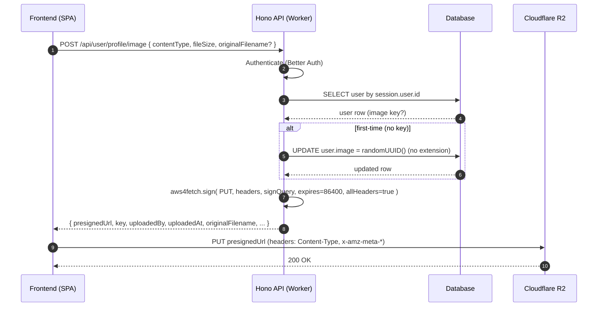
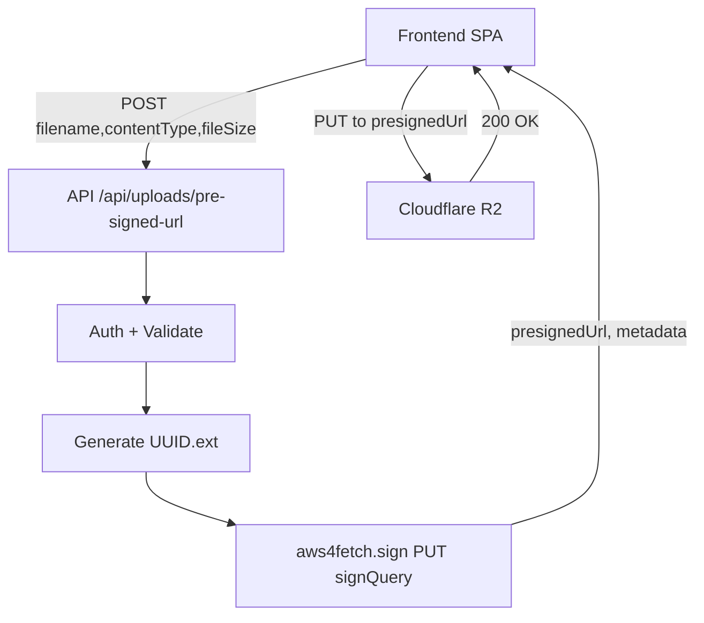
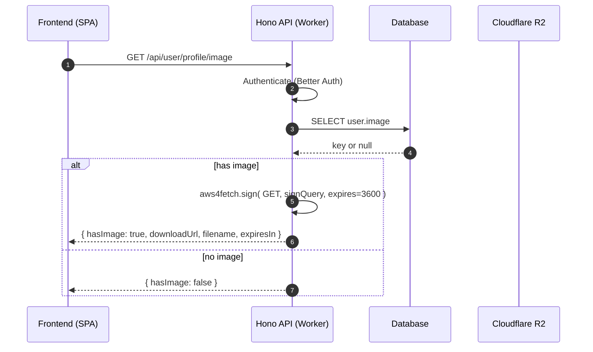

# Pre‑Signed URL Upload Architecture (Cloudflare R2 + Hono Workers)

## Purpose
This document describes a reference architecture for secure, direct browser uploads and downloads to Cloudflare R2 using time‑limited pre‑signed URLs generated by a Hono application on Cloudflare Workers. It covers flows, contracts, security decisions, and pitfalls.

## Components
- Hono API (Cloudflare Workers)
  - Authentication: Better Auth
  - Database: Postgres via Drizzle ORM
  - Storage: Cloudflare R2 (S3‑compatible)
- Frontend SPA (Nuxt)
  - Performs direct PUT uploads and GET downloads via pre‑signed URLs

## Environment and Bindings
- Worker binds the bucket as `env.GALLERY` (bucket name: `gallery`).
- Secrets: `CLOUDFLARE_ACCOUNT_ID`, `R2_ACCESS_KEY_ID`, `R2_SECRET_ACCESS_KEY`.
- R2 signing uses `aws4fetch` (Workers‑compatible `fetch` + `SubtleCrypto`).

## Data Model (Profile Images)
- `user.image` stores the object key (stable, no extension) in the `gallery` bucket.
- First assignment persists a random UUID (no extension). Subsequent uploads overwrite the same object to avoid object sprawl.

## CORS Policy (R2)
R2 requires explicit header names (wildcards are unreliable). Example rule:

```json
{
  "rules": [
    {
      "allowed": {
        "methods": ["PUT", "GET", "POST", "DELETE"],
        "origins": ["*"],
        "headers": [
          "content-type",
          "x-amz-meta-original-filename",
          "x-amz-meta-uploaded-at",
          "x-amz-meta-uploaded-by"
        ]
      },
      "exposeHeaders": ["ETag"],
      "maxAgeSeconds": 3000
    }
  ]
}
```

## Request/Response Contracts (Summary)
- Generic upload URL: `POST /api/uploads/pre-signed-url` (UUID per object)
- Profile image upload URL (stable key): `POST /api/user/profile/image`
  - Request: `{ contentType: string, fileSize: number, originalFilename?: string }`
  - Response: `{ presignedUrl, key, contentType, fileSize, expiresIn: 86400, uploadedBy, uploadedAt, originalFilename }`
  - Frontend must upload with headers:
    - `Content-Type: <file.type>`
    - `x-amz-meta-original-filename: <originalFilename>`
    - `x-amz-meta-uploaded-by: <uploadedBy>`
    - `x-amz-meta-uploaded-at: <uploadedAt>`
  - Do not set `Content-Length` manually.
- Profile image download URL: `GET /api/user/profile/image` → returns pre‑signed GET URL (default 3600s).

## Flow: Profile Image Upload (Stable Key, Overwrite)


## Flow: Generic Upload (UUID per Object)


## Flow: Profile Image Download


## Security Model and Decisions
- Authentication enforced for all signing endpoints.
- Authorization: profile image key is scoped to authenticated user; generic uploads still require session.
- Upload pre‑signed URLs default to 24h (86400s); download URLs commonly 1h (3600s). Use shorter TTLs if needed.
- Overwrite policy for profile images ensures a single object per user.

## Implementation Notes
- Signing: `aws4fetch` options `aws: { signQuery: true, expires: 86400, allHeaders: true }` to include `Content-Type` in the signature.
- R2 object URL: `https://<account-id>.r2.cloudflarestorage.com/<bucket>/<key>`.
- Stable key is UUID without extension; determined/created on first call, then reused.
- Database update for profile (name‑only) must not null `image` unless `image` field is explicitly provided.
- Backend must return the exact metadata used for signing; frontend must reuse it when uploading.
- Generate timestamps once on the backend and reuse in the response to avoid signature drift.

## Known Pitfalls and Mitigations
- Wildcard CORS headers are unreliable on R2 → explicitly allow `content-type` and required `x-amz-meta-*` headers.
- Missing `Content-Type` in signature → 403; ensure it’s included in the signed headers and in the upload.
- Do not send `Content-Length` from the browser.
- AWS SDK v3 is not Workers‑compatible (e.g., `DOMParser`), use `aws4fetch`.
- Inconsistent expiration across flows; standardize.
- Undefined metadata (e.g., `originalFilename`) leads to signature mismatch; always return and reuse exact values.

## Operational Considerations
- Logging: record pre‑signed generation events (do not log secrets).
- Rate limiting (future): throttle pre‑signed URL issuance per user.
- Orphaned objects (future): generic uploads may need cleanup or commit semantics.
- Versioning (future): store multi‑version keys instead of overwrite if historical versions are required.

## Testing Checklist
- CORS preflight for PUT passes with required headers.
- Upload PUT succeeds with exact headers from response.
- Download GET URL works and respects TTL.
- Repeated profile uploads overwrite the same key; `user.image` remains stable.
- Name‑only profile updates leave `user.image` unchanged.
